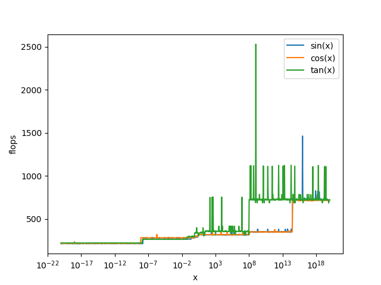
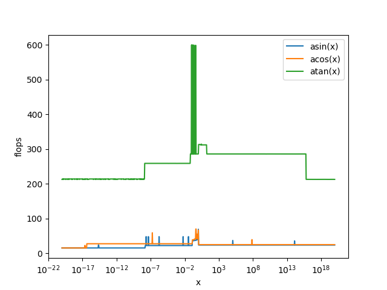
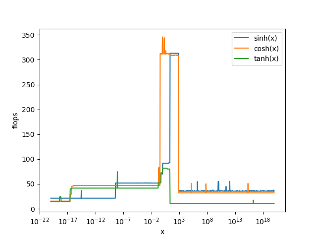
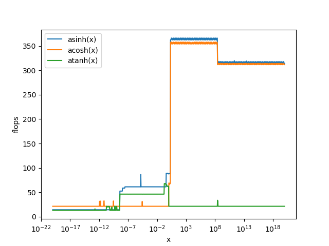
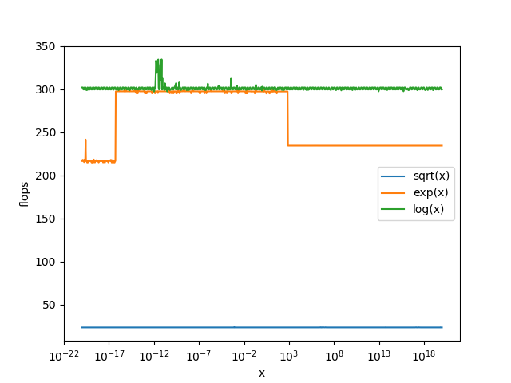

# funperf

measuring performance of sin, cos, sinh, cosh and similar functions

## Instalation

  https://github.com/realead/timeitcpp is used as submodule, thus clone it with `git clone --recursive`.

## Prerequisites

  1. python with pandas+matlibplot

## Running:

Run 

    sh create_report.h

for creating report/images in the subfolder "report".

## Results so far

### Flops

There is a difference whether one calculates independent multiplication, or whether one multiplication depends on the result of the previous multiplication.

In the first case the multiplication can be done almost in parallel due to pipelining in the second case this "parallelization" isn't feasible. For the test machine the performance difference was a slowdown somewhere between 3-4 times. 

As unit we takes a float multiplication/flop from the first scenario.

### Glibc-2.23

#### sin/cos/tan

The costs are (in flops):

            1       10       10^9    3*10^14
    sin    289      320      350      720
    cos    300      320      350      720
    tan    340      340      730      730

It seems as if there were a moderate increase of cost with increasing arguments x, but also some x-values which are pretty "hard" to calculated, all above for tan-functions, but probably also for others

#### asin/acos/atan

The costs are (in flops):

            <1       10       10^9    3*10^14
    asin    40       23        23      23
    acos    50       25        25      25
    atan    300      300      290      290

asin/acos becomes slower with arguments going towards 1, but than the costs are only about 25.

#### asin/acos/atan

The costs are (in flops):

            1       10       10^9    3*10^14
    sinh    90       90        35      35
    cosh    310      310       32      32
    tanh    70       80        10      10

sinh/cosh are costly only for a small (but important) range. tanh is somewhat unexpectedly much less costly than sinh and cosh.

#### asin/acos/atan

The costs are (in flops):

            1       10       10^9    3*10^14
    asinh    90      360      310      310
    acosh    70      350      310      310
    atanh    60       21       21       21

similary to above, atanh is much less costly than asinh and acosh.

#### others

The costs are (in flops):

            1       
    sqrt    24
    exp    300
    log    305

sqrt is pretty cheap compared to exp and log.

