# funperf

measuring performance of sin, cos, sinh, cosh and similar functions

## Instalation

  https://github.com/realead/timeitcpp is used as submodule, thus clone it with `git clone --recursive`.

## Prerequisites

  1. python with pandas+matlibplot

## Running:

Run 

    sh create_report.h

for creating report/images in the subfolder "report".

## Results so far

### Flops

There is a difference whether one calculates independent multiplication, or whether one multiplication depends on the result of the previous multiplication.

In the first case the multiplication can be done almost in parallel due to pipelining in the second case this "parallelization" isn't feasible. For the test machine the performance difference was a slowdown somewhere between 3-4 times. 

As unit we takes a float multiplication/flop from the first scenario.

### Glibc-2.23

#### sin/cos/tan

The costs are (in flops):

            1       10       10^9    3*10^14
    sin    289      320      350      720
    cos    300      320      350      720
    tan    340      340      730      730

It seems as if there were a moderate increase of cost with increasing arguments x, but also some x-values which are pretty "hard" to calculated, all above for tan-functions, but probably also for others

#### asin/acos/atan

The costs are (in flops):

            <1       10       10^9    3*10^14
    asin    40       23        23      23
    acos    50       25        25      25
    atan    300      300      290      290

asin/acos becomes slower with arguments going towards 1, but than the costs are only about 25.

#### asin/acos/atan

The costs are (in flops):

            1       10       10^9    3*10^14
    sinh    90       90        35      35
    cosh    310      310       32      32
    tanh    70       80        10      10

sinh/cosh are costly only for a small (but important) range. tanh is somewhat unexpectedly much less costly than sinh and cosh.

#### asin/acos/atan

The costs are (in flops):

            1       10       10^9    3*10^14
    asinh    90      360      310      310
    acosh    70      350      310      310
    atanh    60       21       21       21

similary to above, atanh is much less costly than asinh and acosh.

#### others

The costs are (in flops):

            1       
    sqrt    24
    exp    300
    log    305

sqrt is pretty cheap compared to exp and log.

#### -ffast-math

adding -ffast-math didn't change much - the only  difference was sqrt, which dropped from 24 flops to 8 flops (see data/test_results_glibc2.23_ffastmath.txt for the performance).

### VisualStudio 2015

The test machines were different (also different generations of Intel-processors), so the comparison is not that good...

#### sin/cos/tan

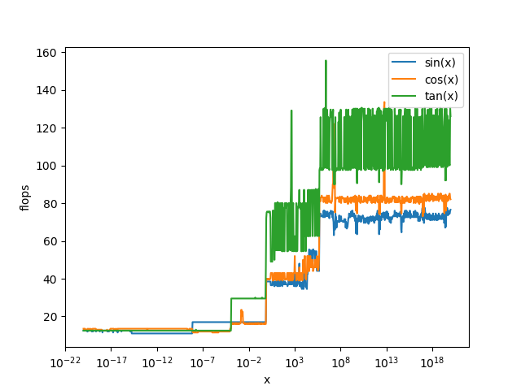

The costs are (in flops):

            1       10       10^9    3*10^14
    sin    39       39       73      75
    cos    40       40       82      82
    tan    75       80      130      130

VS2015 seems to be 5-10 times as fast as glibc-2.23!

#### asin/acos/atan

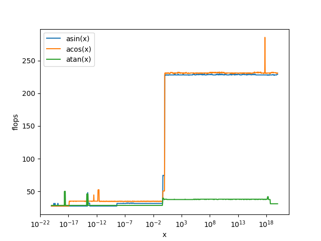

The costs are (in flops):

            <1       10       10^9    3*10^14
    asin    75      228        228      228
    acos    50      230        230      230
    atan    37      37         38       38

atan is about factor 5-10 faster than glibc, but strangely asin/acos are much slower for invalid arguments(>1). Otherwise CS2015 is about 2 times faster for asin/acos.

#### asin/acos/atan

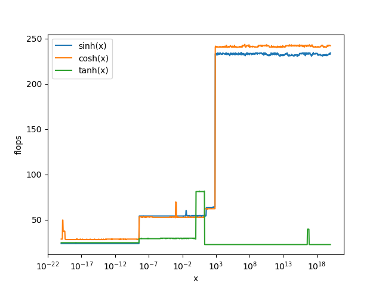

The costs are (in flops):

            1       10       10^9    3*10^14
    sinh    55       55        233      233
    cosh    52       81        242      242
    tanh    81       80        22       22

probably handling nans is pretty costly (for algorithm or the architecture)

#### asin/acos/atan

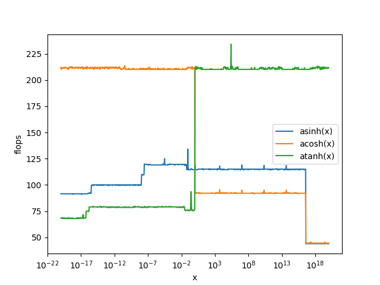

The costs are (in flops):

            1       10       10^9    3*10^14
    asinh   114    115        114      115
    acosh   211    92         92        92
    atanh    76    211        210       210

probably handling nans is pretty costly (for algorithm or the architecture)

#### others

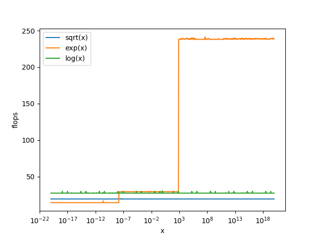

The costs are (in flops):

            1       
    sqrt    19
    exp     29
    log     27

exp and log are about factor 10 faster than glibc.

### Intel(R) Math Kernel Library Version 2019.0.3, 64bit

The same test machine as glibc. To run, set environments variable `MKL_INCLUDE` (can be `src/my_mkl`) and `MKL_LIB` and run `creater_vml_report.sh`, e.g.:

    export MKL_INCLUDE=my_mkl
    export MKL_LIB=/home/ed/anaconda37/lib 
    sh create_vml_report.sh

all results are for single-thread.

#### sin/cos/tan

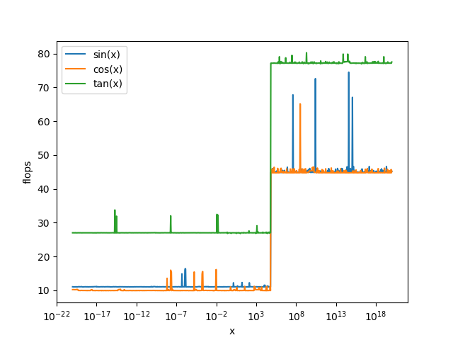

The costs are (in flops):

            1       10       10^9    3*10^14
    sin    11       11       45      45
    cos    10       10       45      45
    tan    27       27       77      78

10-30 times faster than glibc-2.23, and much faster than MSVC2015.

#### asin/acos/atan

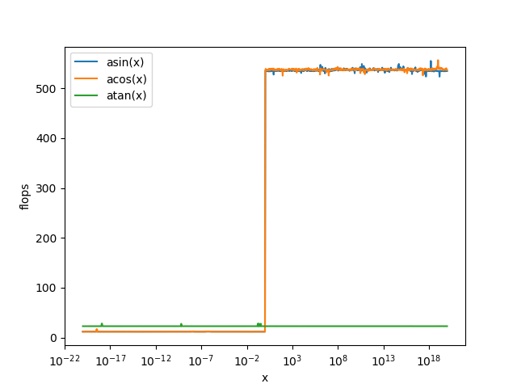

The costs are (in flops):

            <1       10       10^9    3*10^14
    asin    12      535        535      535
    acos    12      535        535      535
    atan    23      23         23       23

atan is about factor 15 faster than glibc, but strangely asin/acos are much slower for invalid arguments(>1). However, VML is otherwise 4 times faster.

#### asin/acos/atan

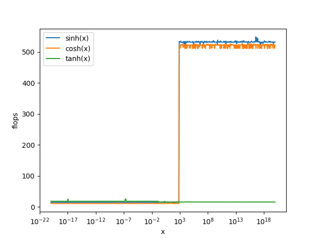

The costs are (in flops):

            1       10       10^9    3*10^14
    sinh    15       15        532      532
    cosh    11       11        522      522
    tanh    15       15        15       15

the most difference is for small values of cosh: 30 times faster (otherwise factor 4).

#### asin/acos/atan

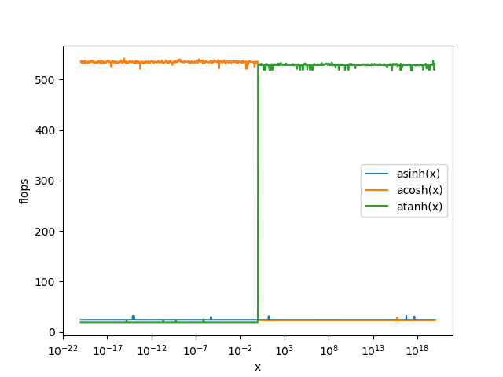

The costs are (in flops):

            <1       10       10^9    3*10^14
    asinh   24      24        24      24
    acosh   23      23        23      23
    atanh   19     527       527     527

about 4 times faster than glibc (for non-nan-values)

#### others

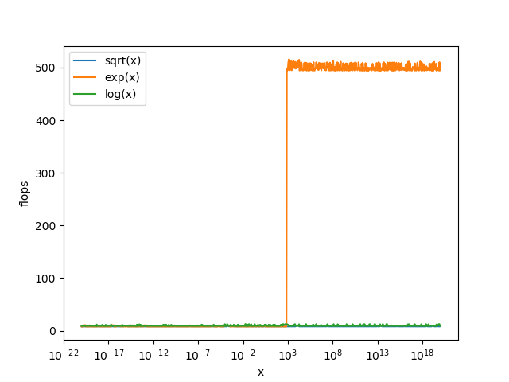

The costs are (in flops):

            1     10^9   
    sqrt    8       8
    exp     8     500
    log     9       9

exp and log are factor 40 faster than glibc (once again slower when result not finite)

#### accuracy - modes

for different accuracy-modes we get:

  VML_HA 	high accuracy versions of VM functions
  VML_LA 	low accuracy versions of VM functions
  VML_EP  enhanced performance accuracy versions of VM functions

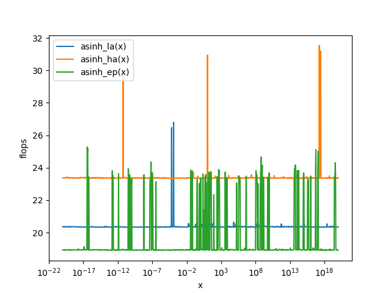

The costs for `asinh` (the slowest function) are (in flops):

             1 
    VML_HA   24 
    VML_LA   20.5 
    VML_EP   19 

which meas additional 20% could be won by switching to the less precise mode.

In overall, Intel's vml is a great improvement compared to glibc and the much faster MSVC2015. However, having non-finite results (nan/infinity) has a very big negative impact on performance

#### parallel version:

linking against `-lmkl_gnu_thread -liomp5` instead of `-lmkl_sequential` leads to usage of parallel version.

However, for small number of elements,VML falls back to the sequential version. Which number is considered big enough to start the parallelized version depends on function, for example:

For `sin` parallelization kicks in earlier than for `exp`. 

